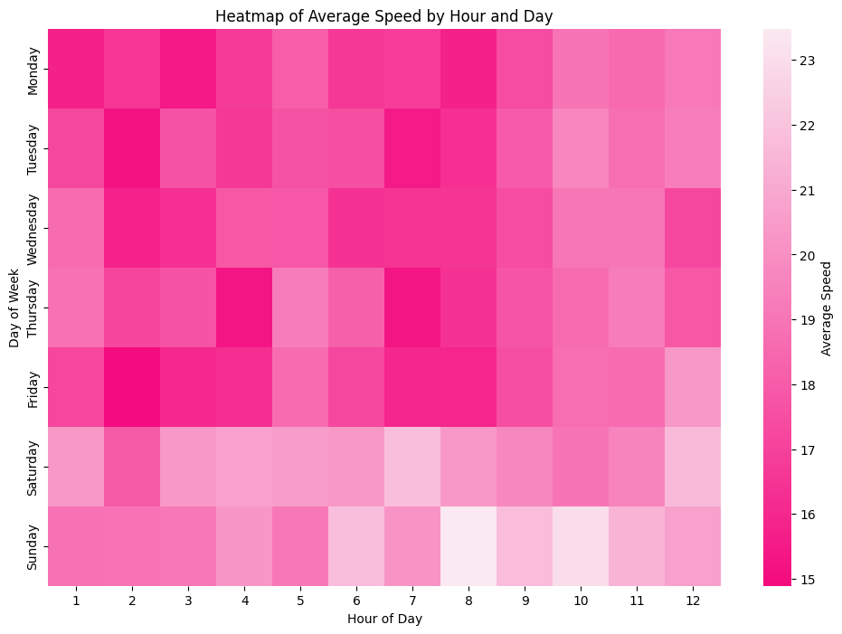

# Taxi_duration_model_Mexico_City

A brief description of the idea behind this project

## Table of Contents

-[Motivation](#Motivation)
-[Methodology](#Methodology)
-[Key Findings](#Key_Findings)
-[Model Performance](#Model_Performance)
-[Conclusion](#Conclusion)

## Motivation

I wanted to select a dataset that was not something familiar to me but also somehting I could complete in the 24 hours i had. So I chose to do something about my country, Mexico. I found taxi trip data in Kaggle (https://www.kaggle.com/datasets/mnavas/taxi-routes-for-mexico-city-and-quito/code) which sounded like a great opportunity. I had to think about a specific problem to solve. I understood that there have been multiple models that estimate the time duration of taxi trips so I wanted to give my own twist at the end. I would use it to predict if you should move closer to your place of work depending on the rent, and the time and money expended in the trips.

Below a map with 200 samples of the clean dataframe are shown to visualize the locations of the taxi trips.

## Methodology

The first hurdle I was present was the fact that I had only 24 hours to complete the assignment, so I decided to only create a model to estimate the time a taxi takes from different starting points and ending points in Mexico City. This left the estimation of the rent to variables the user has to decide. 

The first step in the process was to clean the database since it had multiple datapoints that were outliers. For example, a trip taht apparently took 139 years to complete, and one which average speed was 1900 Km/h, ¡Ridiculous! 

Once the data was cleaned, analysis on the different columns was made to understand which ones would be most useful during the creation of features and the training of the models. Some data like the 'vendor_id' was limited to only some specific values since it had some very low frequency categorical values that could skew results. 

In feature engineering there were 4 variables that were created and used in the final models. The first was a variable called 'traffic_day' which aims to represent if that specific day of the week has in average more traffic than others. The next one was the manhattan distance which is a variable widely used in taxi trip models because it takes a normal distance and measures it as if it was a gridlike pattern. Lastly there were two variables which aim was to create different groupings of locations on the map these were called 'pickup_zone' and 'dropoff_zone' depending on if they were starting points or end points.

Once the variables that would be used for the model were selected, the categorical variables were one hot encoded and the numerical ones were scaled. These were used to train the 5 following models:  Ridge regression, Lasso Regression, Random Forest, XGBoosted Regressor and a neural network. From the five the one with the best RMSE and good behaviour was selected.

## Key_Findings

An unfortunate finding that was made when working towards the 'traffic_day' variable was the fact that the data had an issue with its datetime variables. The time was formatted in a 12 hour clock, yet there was no indicator for a.m. or p.m. This meant that using the hour of the day or the traffic during a specific hour of the day would not be useful. Nevertheless, from the heatmap seen below it is certain that in Saturdays and Sundays taxis have in average higher speed which means less traffic.
  

Another key finding was that the 'traffic_day' variable worked like expected for all models except one. In all models the time of the trip increased if the variable indicated that there was traffic, but for the Random Forest the time surprisingly went down. This made it harder for that model to be selected even if it was the highest performer.

## Model_Performance

After training the following table of results was built:

| Model            | R-squared | MAE     | MSE        | RMSE    |
|------------------|-----------|---------|------------|---------|
| Ridge Regression | 0.668     | 343.494 | 416362.676 | 645.262 |
| Lasso Regression | 0.668     | 343.547 | 417023.013 | 645.773 |
| Random Forest    | 0.695     | 320.068 | 382844.496 | 618.744 |
| XGBoost          | 0.684     | 327.334 | 396037.812 | 629.315 |
| Neural Network   | 0.678     | 356.955 | 403850.156 | 635.492 |

The best model out of the bunc is the Random Forest since it has the lowest RMSE and the best metrics overall. Yet as said in the previous chapter it did not follow the traffic logic, so the next best model was selected which was the XGBoost. When checking the MAE and RMSE we can see that the models miss actual predictions by up to 10 min! The models still can give a good prediction and with more time and fine tuning of the models better results can certainly be achieved.

It was used to simulate one trip to work for me! i used data points nearby as to no disclose personal information, and dummy data of a current rent of 16,000 MXN and an average rent nearby my workplace of 20,000 MXN to feed the function at the end. This function took the prediction made by the best model and calculating the price of the taxi and decided if the amount of money used to go to work exceded the rent near the workplace. The results were the following:

  "You should move near your work.
  Between rent and transport you are spending $20579.28 while rent near your job is $20000
  You will be saving $579.28 and 26.45 hours every month"

## Conclusion

I decided to focus most of my 24 hours in creative uses of the models and creative feature engineering. That led way to interesting variables used in the models even though that was at the stake of not fine tuning the models very much. Still I think that the results gotten by the models where very good for a 24 hour project. Specially since all of the work can be used as a starting point for a deeper and better performing model.
